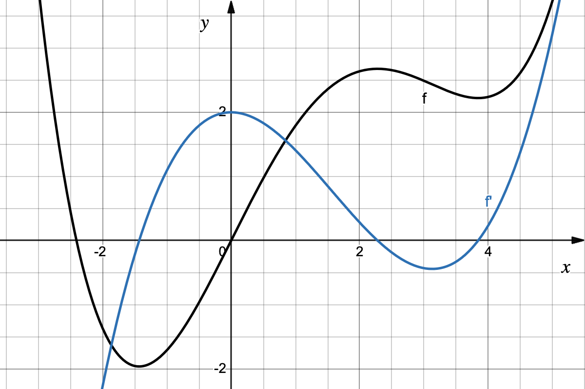
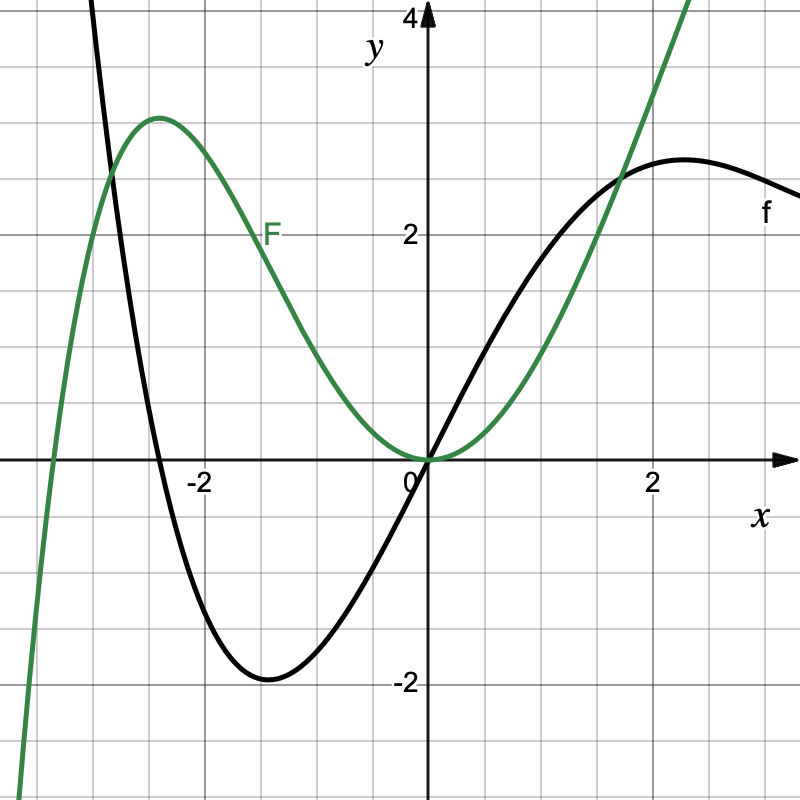

# Grafisches Differenzieren - Lösung

### a) Skizzieren der Ableitungsfunktion $f'$

{width="60%"}
/// caption
Graph der Funktion $f$ (schwarz) und der zugehörigen Ableitung $f'$ (blau).
///

Beim Skizzieren von $f'$ orientieren wir uns am Anstieg von $f$:
1. **Nullstellen:** $f$ hat zwei Tiefpunkte (bei $x \approx -1,4$ und $x \approx 3,7$) und einen Hochpunkt (bei $x \approx 2,3$). An diesen drei Stellen hat $f$ waagerechte Tangenten (Anstieg $0$), daher hat $f'$ dort seine **Nullstellen**.
2. **Vorzeichen:** * Links vom ersten TP fällt $f \implies f'$ ist im negativen Bereich.
   * Zwischen dem ersten TP und dem HP steigt $f \implies f'$ ist im positiven Bereich.
   * Zwischen dem HP und dem zweiten TP fällt $f \implies f'$ ist im negativen Bereich.
   * Rechts vom zweiten TP steigt $f \implies f'$ ist im positiven Bereich.

### b) Vergleich mit $g(x) = f(x) + 2$
**Entscheidung:** Ja, $g$ hat dieselbe Ableitungsfunktion wie $f$.

**Begründung:**
Der Graph von $g$ ist gegenüber $f$ lediglich um $2$ Einheiten nach oben verschoben. Die Steigung des Graphen ändert sich durch diese Verschiebung an keiner Stelle. Da die Ableitung genau diesen Anstieg beschreibt, gilt $g'(x) = f'(x)$.

### c) Skizzieren der Funktion $F$ mit $F' = f$

{width="60%"}
/// caption
Graph der Funktion $f$ (schwarz) und der zugehörigen Funktion $F$ mit $F'=f$ (grün).
///

Hier ist $f$ die "Steigungsvorgabe" für unseren Graphen $F$:
1. **Waagerechte Tangenten in $F$:** Überall dort, wo $f$ die x-Achse schneidet (bei $x \approx -2,7$ und $x = 0$), muss $F$ einen Extrempunkt haben.
2. **Verlauf:**
   * Da $f$ bis $x \approx -2,7$ negativ ist, muss $F$ bis dorthin fallen.
   * Da $f$ zwischen $x \approx -2,7$ und $x = 0$ positiv ist, muss $F$ dort steigen.
   * Da $f$ ab $x = 0$ wieder negativ ist (bis weit nach rechts), muss $F$ ab dort wieder fallen.
3. **Besonderheit:** Da wir den Startpunkt von $F$ nicht kennen, kann der Graph beliebig weit nach oben oder unten verschoben gezeichnet werden.