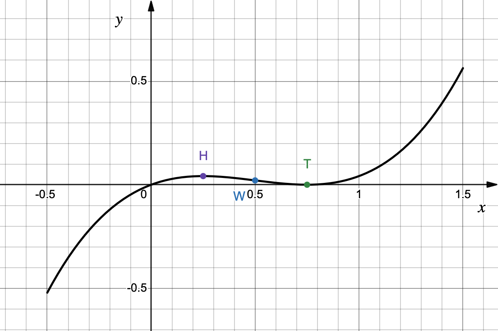

# Umfassende Funktionsanalyse - Lösung

### a) Bestimmen der Nullstellen, Extrempunkte und des Wendepunkts
**Nullstellen:**
$$\begin{aligned}
0 &= \frac{2}{3}x^3 - x^2 + \frac{3}{8}x \\\\
0 &= x \cdot \left(\frac{2}{3}x^2 - x + \frac{3}{8}\right)
\end{aligned}
$$
$x_{N1} = 0$. Für den Klammerausdruck (Multiplikation mit $\frac{3}{2}$):
$$\begin{aligned}
0 &= x^2 - \frac{3}{2}x + \frac{9}{16} \\\\
x_{2,3} &= \frac{3}{4} \pm \sqrt{\left(\frac{3}{4}\right)^2 - \frac{9}{16}} \\\\
x_{N2} &= \frac{3}{4}
\end{aligned}
$$
Nullstellen bei $x_{N1}=0$ und $x_{N2}=\frac{3}{4}$.

**Extrempunkte:**  
Ableitungen: $f'(x) = 2x^2 - 2x + \frac{3}{8}$ und $f''(x) = 4x - 2$.
Notwendige Bedingung $f'(x) = 0$:
$$
\begin{aligned}
0 &= 2x^2 - 2x + \frac{3}{8} \quad | :2 \\\\
0 &= x^2 - x + \frac{3}{16} \\\\
x_{1,2} &= \frac{1}{2} \pm \sqrt{\left(\frac{1}{2}\right)^2 - \frac{3}{16}} \\\\
x_{1,2} &= \frac{1}{2} \pm \frac{1}{4} \\\\
x_1 &= \frac{3}{4}; \quad x_2 = \frac{1}{4}
\end{aligned}
$$
Prüfung mit $f''(x)$:

* $f''(\frac{3}{4}) = 4 \cdot \frac{3}{4} - 2 = 1 > 0 \implies$ Tiefpunkt/Minimum (T)
* $f''(\frac{1}{4}) = 4 \cdot \frac{1}{4} - 2 = -1 < 0 \implies$ Hochpunkt/Maximum (H)

Y-Werte:  
$f(\frac{3}{4}) = 0$  
$f(\frac{1}{4}) = \frac{2}{3} \cdot \frac{1}{64} - \frac{1}{16} + \frac{3}{8} \cdot \frac{1}{4} = \frac{1}{24}$.  
Ergebnis: $T(\frac{3}{4}|0)$ und $H(\frac{1}{4}|\frac{1}{24})$.

**Wendepunkt:**
$$\begin{aligned}
0 &= 4x - 2 \\\\
x_w &= \frac{1}{2}
\end{aligned}
$$
Da $f''(x)$ eine lineare Funktion ist, existiert genau eine Nullstelle.  
Mit $f'''(x) = 4 > 0$ existiert genau Rechts-Links-Wendepunkt (W).  
$f(\frac{1}{2}) = \frac{2}{3} \cdot \frac{1}{8} - \frac{1}{4} + \frac{3}{8} \cdot \frac{1}{2} = \frac{1}{48}$.  
Ergebnis: $W(\frac{1}{2}|\frac{1}{48})$.

### b) Gezeichneter Graph
Ein Skizzieren genügt.
{width="60%"}
/// caption
Graph der Funktion $f$ (schwarz).
///

### c) Tangentengleichung $t(x)=m\cdot x +n$ und Flächeninhalt
Punkt $P(\frac{1}{2} | \frac{1}{48})$:  
Steigung: $m = f'(\frac{1}{2}) = 2(\frac{1}{2})^2 - 2(\frac{1}{2}) + \frac{3}{8} = -\frac{1}{8}$.
$$\begin{aligned}
\frac{1}{48} &= -\frac{1}{8} \cdot \frac{1}{2} + n \\\\
n &= \frac{1}{12}
\end{aligned}
$$
Tangente: $t(x) = -\frac{1}{8}x + \frac{1}{12}$.

Flächeninhalt:
$y$-Achsenabschnitt $n = \frac{1}{12}$. Nullstelle der Tangente: $0 = -\frac{1}{8}x + \frac{1}{12} \implies \frac{1}{8}x = \frac{1}{12} \implies x_0 = \frac{8}{12} = \frac{2}{3}$.
$$\begin{aligned}
A &= \frac{1}{2} \cdot |x_0| \cdot |n| \\\\
A &= \frac{1}{2} \cdot \frac{2}{3} \cdot \frac{1}{12} = \frac{1}{36} \text{ FE}
\end{aligned}
$$

### d) Abszissen der parallelen Tangenten
Steigung der Geraden $g$ durch $A(0|1)$ und $B(4|\frac{5}{2})$:
$$\begin{aligned}
m_g &= \frac{\frac{5}{2} - 1}{4 - 0} \\\\
m_g &= \frac{\frac{3}{2}}{4} = \frac{3}{8}
\end{aligned}
$$
Gleichsetzen mit $f'(x)$:
$$\begin{aligned}
2x^2 - 2x + \frac{3}{8} &= \frac{3}{8} \\\\
2x^2 - 2x &= 0 \\\\
2x(x - 1) &= 0
\end{aligned}
$$
Ergebnis: Die Abszissen der Berührpunkte sind $x_1 = 0$ und $x_2 = 1$.