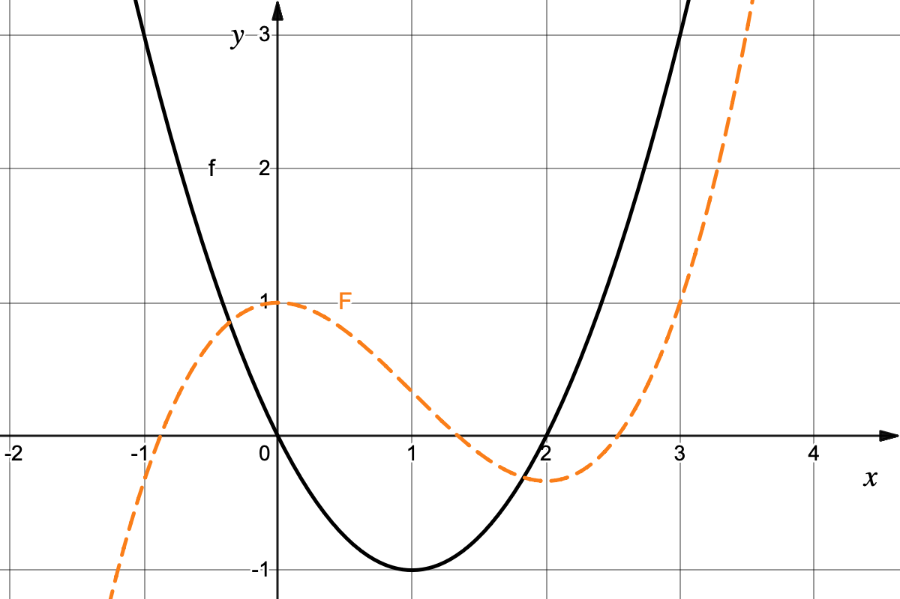

# Grafisches Aufleiten - Lösung

### a) Analyse der markanten Punkte
Die Stammfunktion $F(x)$ lässt sich durch den Zusammenhang $F'(x) = f(x)$ punktweise skizzieren:

| Stelle / Intervall | Eigenschaft von $f$ | Konsequenz für $F$ |
| :--- | :--- | :--- |
| **$x = 0$** | Nullstelle (VZW von $+$ nach $-$) | **Hochpunkt** bei $y=1$ wegen $P(0\mid 1)$ |
| **$x = 1$** | Tiefpunkt (Minimum) | **Wendepunkt** (steilste negative Steigung) |
| **$x = 2$** | Nullstelle (VZW von $-$ nach $+$) | **Tiefpunkt** |
| $x < 0$ | $f(x) > 0$ | Graph **steigt** |
| $0 < x < 2$ | $f(x) < 0$ | Graph **fällt** |
| $x > 2$ | $f(x) > 0$ | Graph **steigt** |

#### Grafische Darstellung
Der Graph von $F$ ist eine Funktion 3. Grades (kubische Parabel). Er kommt von links unten, hat bei $(0|1)$ einen Hochpunkt, geht bei $x=1$ durch einen Wendepunkt und erreicht bei $x=2$ seinen Tiefpunkt, bevor er wieder dauerhaft ansteigt.

{width="60%"}
/// caption
Graph der Funktion $f$ (schwarz) und der zugehörigen Stammfunktion $F$ durch $P(0|1)$ (gestrichelt, orange).
///

### b) Begründung der Zusammenhänge
1.  **Nullstellen:** Da $f$ die Ableitung von $F$ ist, bedeuten Nullstellen von $f$ eine Steigung von $0$ bei $F$. Ein Vorzeichenwechsel (VZW) in $f$ zeigt an, ob es sich um einen Hochpunkt ($+ \to -$) oder Tiefpunkt ($- \to +$) handelt.
2.  **Tiefpunkt der Parabel:** Der Scheitelpunkt der Parabel bei $x=1$ ist die Stelle, an der $f$ ihren kleinsten Wert annimmt. Für $F$ bedeutet das: Hier ist die Abwärtssteigung am größten. Dies ist der **Wendepunkt** der Stammfunktion.

