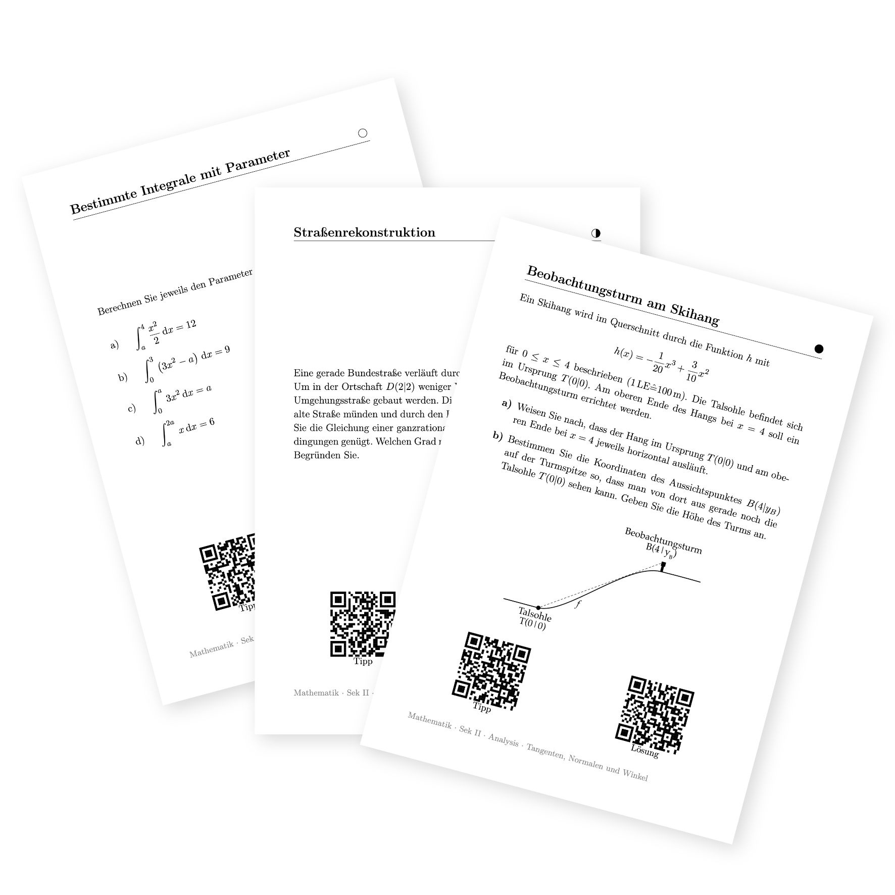

---
hide:
  - navigation
  - toc
---

  <h1 style="font-size: 2.5rem; font-weight: 700; margin-bottom: 1rem; line-height: 1.2;">
    Klausurvorbereitung per QR-Code
  </h1>
  

    Gedruckte Aufgabenkarten für die Sekundarstufe II. Durch das QR-Code-System steuern sich die Schülerinnen und Schüler komplett selbstständig durch die Wiederholung.
  

  
  <a href="https://eduki.com/de/..." class="neumorph-btn neumorph-btn-cta">
    📦 Zu den Materialpaketen auf Eduki
  </a>

  

<h2 style="text-align: center; margin-bottom: 2.5rem; font-weight: 600;">Der Ablauf im Unterricht</h2>

  
  

    
🖨️

    <h3 style="margin-top: 0; ">1. Karten auslegen</h3>
    

      Du druckst das PDF aus und legst die Karten im Raum aus (z. B. als Lerntheke oder Stationsarbeit).
    

  

  

    
🎯

    <h3 style="margin-top: 0;">2. Differenziert üben</h3>
    

      Die Schüler wählen Aufgaben passend zu ihrem Leistungsstand. Das Niveau ist direkt auf der Karte sichtbar.
    

  

  

    
📱

    <h3 style="margin-top: 0;">3. Hilfe per QR-Code</h3>
    

      Wer hakt, scannt den Tipp-Code für einen kleinen Schubs. Wer fertig ist, kontrolliert sich über den Lösungs-Code selbst.
    

  

  <h2 style="text-align: center; margin-bottom: 1.5rem; font-weight: 600;">Warum das Ganze?</h2>
  <blockquote style="margin: 0; padding: 1rem 2rem; border-left: 4px solid #4caf50; background: rgba(255,255,255,0.02); border-radius: 0 12px 12px 0;">
    

      "Kennt wahrscheinlich jeder: Die letzte Stunde vor der Klausur steht an. Ein neues Thema anzufangen bringt nichts mehr. Setzt man die Schüler einfach vor das Buch, blockieren die einen, während sich die anderen langweilen. 
    

    

      Genau dafür sind die Karten da. Die QR-Codes fangen die typischen Fragen ('Wie ging nochmal die pq-Formel?') digital ab. Dadurch herrscht Ruhe im Raum und man hat als Lehrkraft endlich die Zeit, sich gezielt zu den Schülern zu setzen, die gerade wirklich Hilfe brauchen."
    

  </blockquote>

